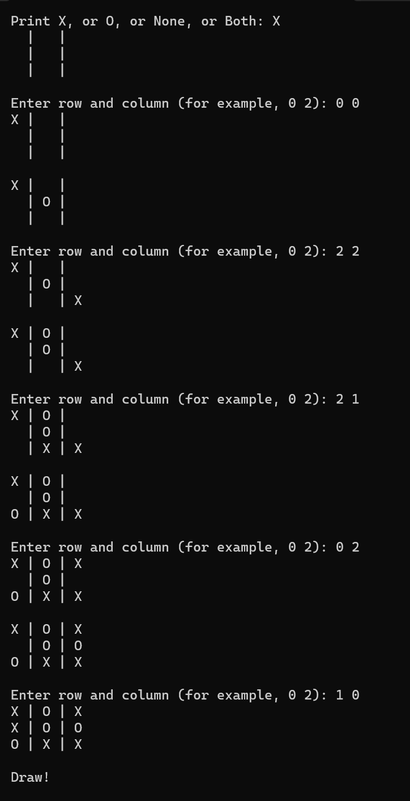
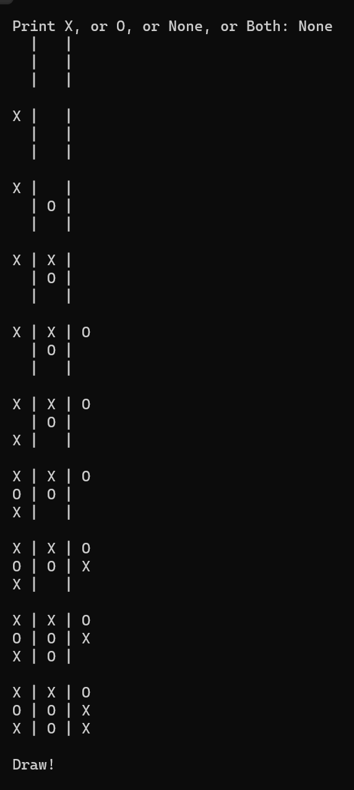
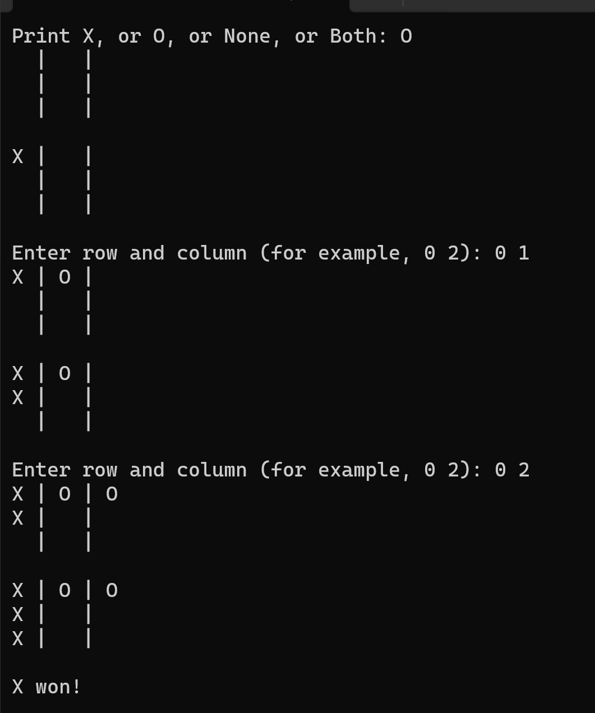

### Tic tac toe using Minimax algorithm

### How to run
You need .NET 8 installed.
```csharp
dotnet run
```

### How to play

The game can be played in 4 modes: 
1. User is X, AI is O. The game is ended in draw or AI wins.
1. User is O, AI is X. The game is ended in draw or AI wins.
1. None: AI plays for both. The game is always ended in draw.
1. Both: User plays for both X and O. 

### Screenshots:

##### Playing for X against AI playing for O:



##### AI plays for both X and O:



##### Deliberately loosing to AI:

